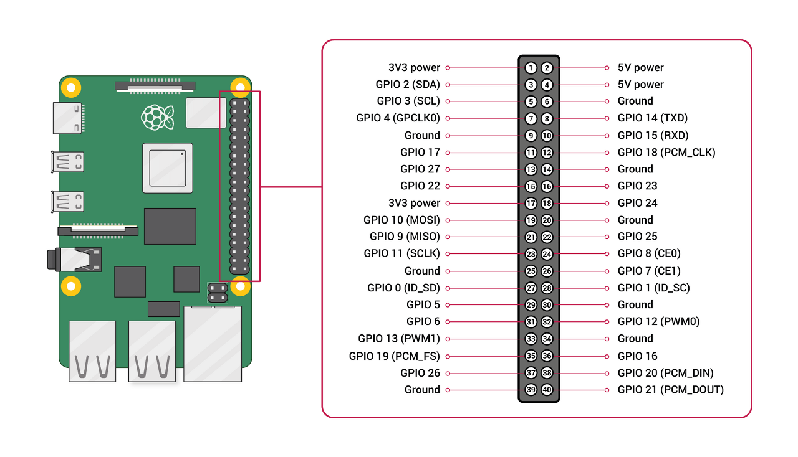

# raspberry_pi_ros_tutorial

Provides raspberry pi reference with ROS

### Pin Map

### Package Lists

- [led_tutorial](https://github.com/PigeonSensei/raspberry_pi_ros_tutorial/tree/main/led_tutorial)
