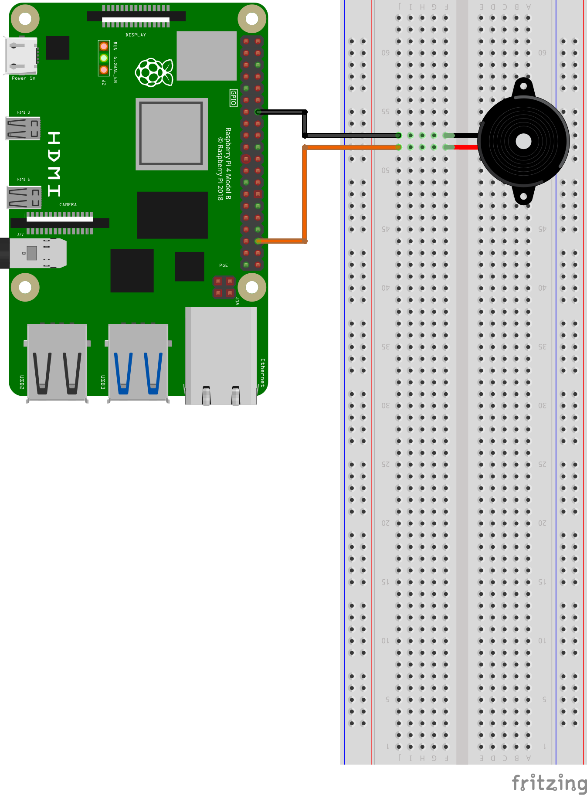
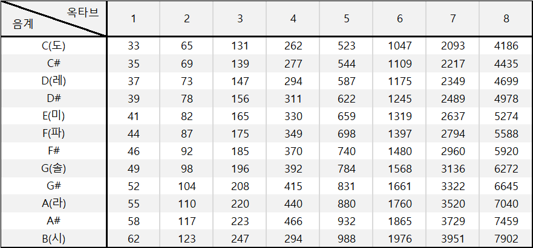

# buzzer_tutorial

Provide buzzer control reference using Raspberry Pi and ROS

## basic_buzzer_node

Provides a simple buzzer control example

### Demo

https://youtu.be/AEsafJynOPo

### Diagram



### Run

```bash
roslaunch buzzer_tutorial basic_buzzer.launch
```

### Parameters

- ~**BuzzerPin** (int, default: "0")

  Gpio Pin number corresponding to Buzzer

----


## buzzer_melody_node

Provides an example of Buzzer Melody

### Demo

https://youtu.be/6_yFz_i__Zk

### Diagram


### Run

```bash
roslaunch buzzer_tutorial buzzer_melody.launch
```

### Parameters

- ~**BuzzerPin** (int, default: "0")

  Gpio Pin number corresponding to Buzzer

----

### Note



