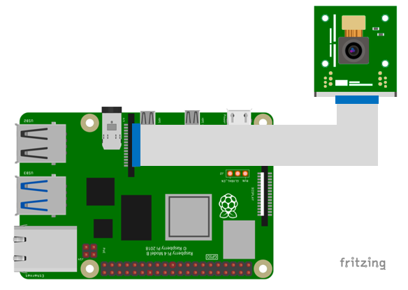

# camera_tutorial

Provide RaspberryPi Camera Module reference using Raspberry Pi and ROS

## basic_camera_node

Example of publishing a camera image to a ROS topic

### Demo


### Diagram



### Setup

Make sure your camera unit is ready

```bash
ls -ltrh /dev/video*
```

Usually the camera number is **0**.

If you do not have a camera unit, follow the procedure below.

Open the ```/boot/firmware/config.txt``` file with administrator privileges 

Below shows an example

```bash
sudo nano /boot/firmware/config.txt
```

Type the following in the bottom line, save and reboot.

```bash
start_x=1
gpu_mem=128
```

- **start_x=1** : should be specified when using the camera module [Required]

- **gpu_mem=128** : Set GPU memory to 128 MB [options]

See documentation below for details

https://www.raspberrypi.com/documentation/computers/config_txt.html


### Run

```bash
roslaunch camera_tutorial basic_camera.launch
```

### Published Topics

- camera_image ([sensor_msgs/Image](http://docs.ros.org/en/noetic/api/sensor_msgs/html/msg/Image.html))

  This is a video taken by the camera

### Parameters

- ~VideoDevice (int, default: "0")
  
  number of video devices
  
  
- ~Hz (int, default: "30")

  frequency of the image
  
  
- ~Resolution (int, default: "0")

  video resolution
  
  - **1** : 640x320
  - **2** : 320x240
  - **3** : 160x120
  - **others** : Camera's defult resolution
  
