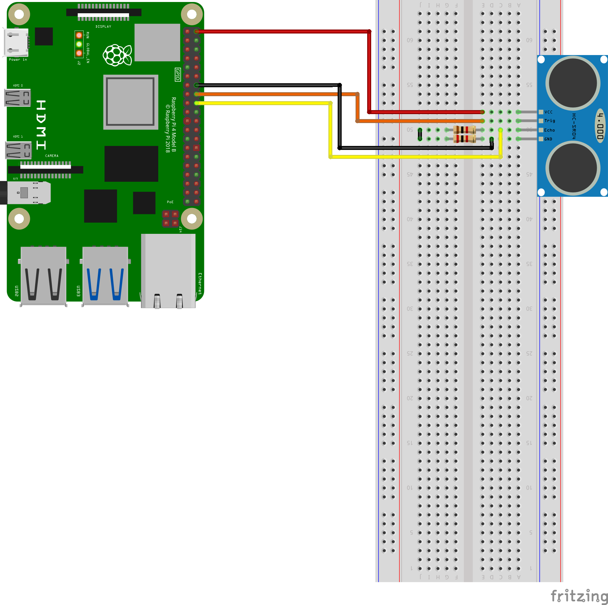

# echo_tutorial

Provide Echo sensor control reference using Raspberry Pi and ROS

## basic_echo_node

Provides a simple Echo sensor control example

### Demo

https://youtu.be/QNYcBuuPN3o


### Diagram



### Run

```bash
roslaunch echo_tutorial basic_echo.launch
```


### Published Topics

- echo_distance ([echo_tutorial/EchoDistance](https://github.com/PigeonSensei/raspberry_pi_ros_tutorial/blob/main/echo_tutorial/msg/EchoDistance.msg))

  Distance detected by ultrasonic sensor

### Parameters

- ~Trig (int, default: "-1")

  Gpio Pin number corresponding to Trig of Echo sensor
  
  
- ~Echo (int, default: "-1")

  Gpio Pin number corresponding to Echo of Echo sensor
  
  
- ~MaxDistance (int, default: "10")

  Set the maximum sensing distance of the sensor.
  
  Outputs -1 when out of detection range.
  
