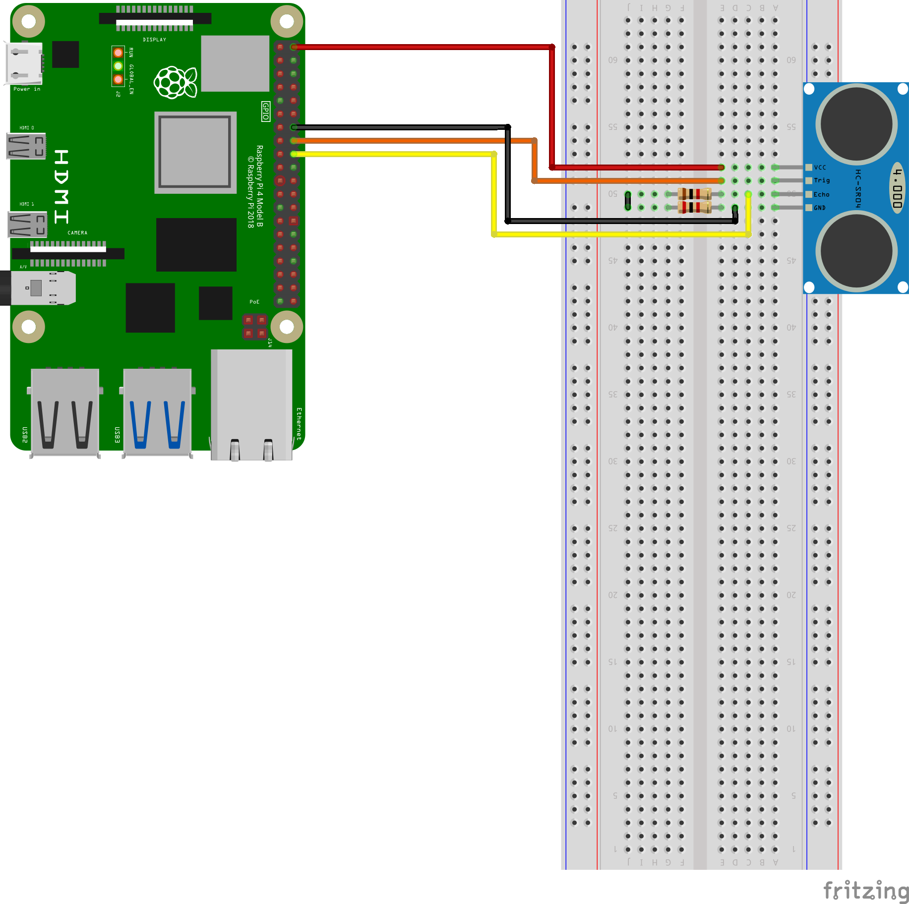

# echo_tutorial

Provide Echo sensor control reference using Raspberry Pi and ROS

## basic_echo_node

Provides a simple Echo sensor control example

### Demo


### Diagram



### Run

```bash
roslaunch echo_tutorial basic_echo.launch
```

### Parameters

- ~Trig (int, default: "-1")

  Gpio Pin number corresponding to Echo sensor of Trig
  
  
- ~Echo (int, default: "-1")

  Gpio Pin number corresponding to Echo sensor of Echo
  
  
- ~MaxDistance (int, default: "-1")

  Set the maximum sensing distance of the sensor.
  
  Outputs -1 when out of detection range.
  
