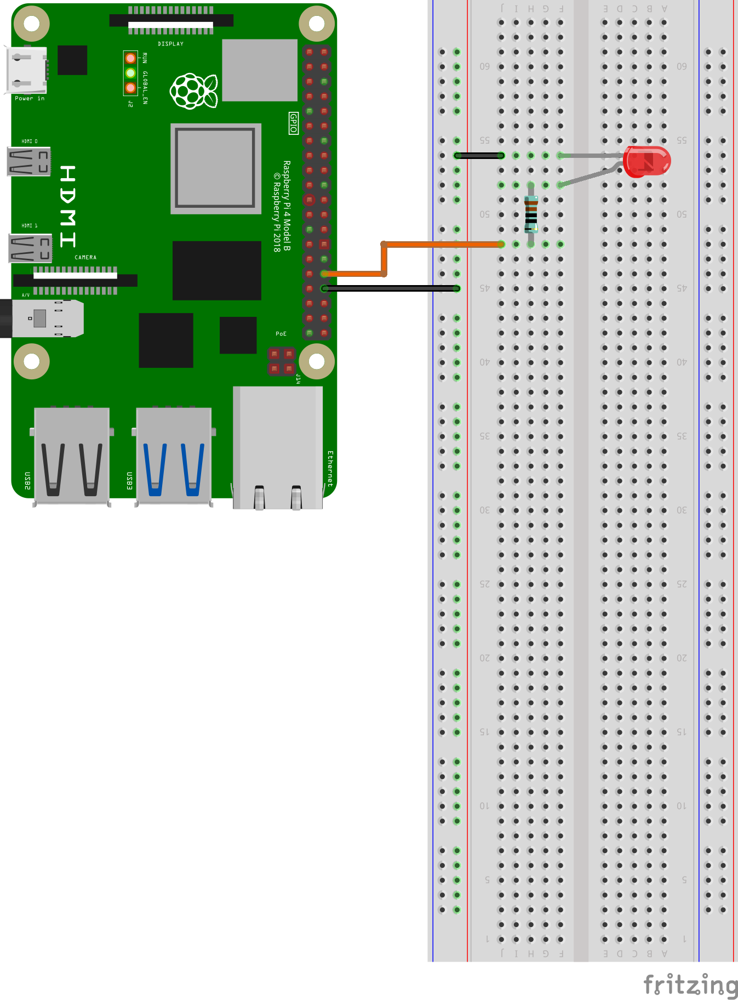
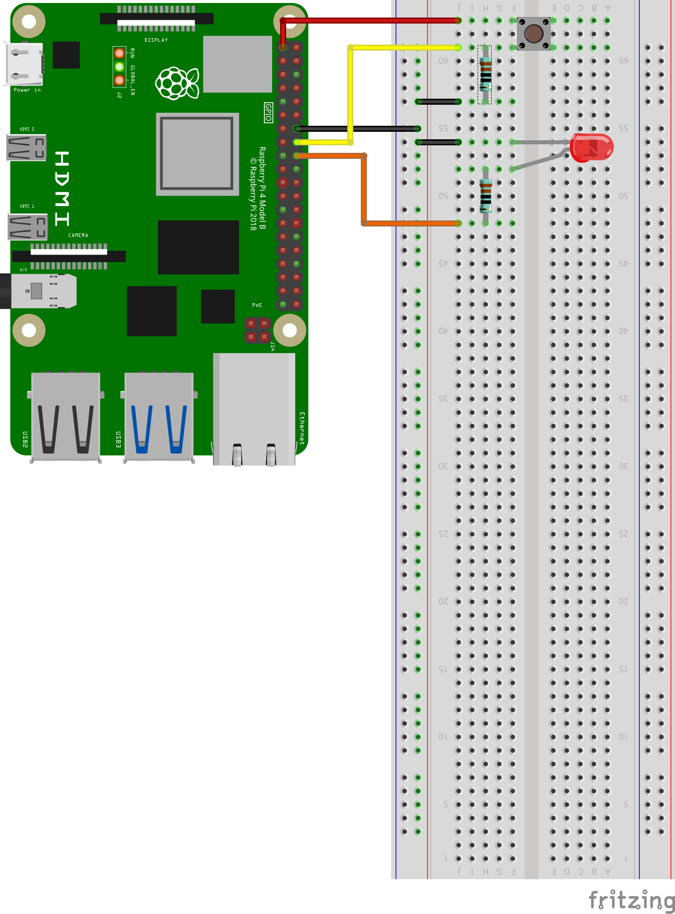
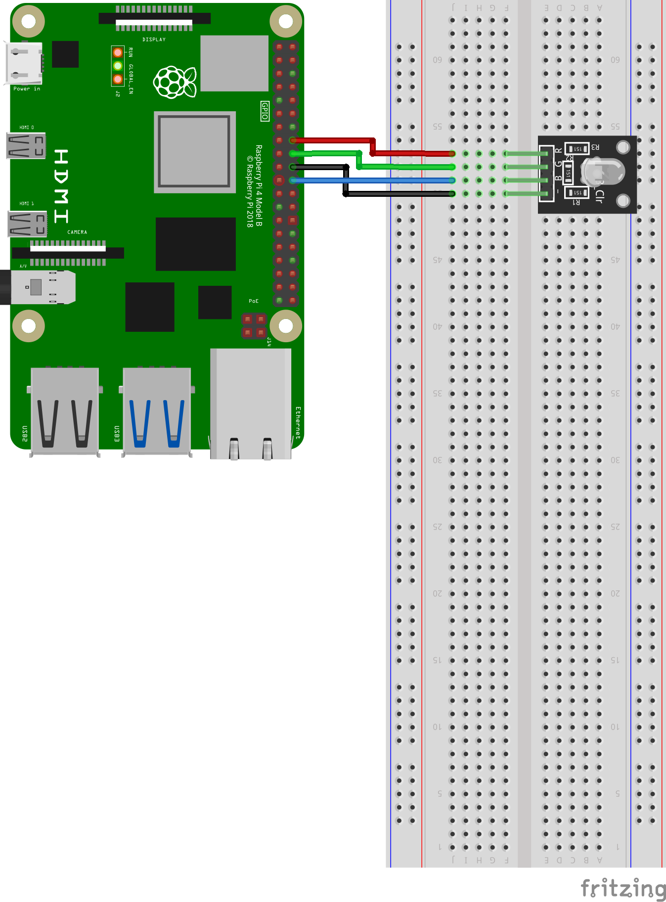

# led_tutorial

Provide LED control reference using Raspberry Pi and ROS

## basic_led_node

Provides a simple LED control example

### Demo

https://youtu.be/mm998wcM_nk

### Diagram



### Run

```bash
roslaunch led_tutorial basic_led.launch
```

### Parameters

- ~LEDPin (int, default: "0")

  Gpio Pin number corresponding to LED

----


## switch_on_led_node

Provides an example of LED control using a switch

### Demo

https://youtu.be/dZ0Ck_IMs8k


### Diagram



### Run

```bash
roslaunch led_tutorial switch_on_led.launch
```

### Parameters

- ~LEDPin (int, default: "0")

  Gpio Pin number corresponding to LED

- ~SwitchPin (int, default: "0")

  Gpio Pin number corresponding to Switch

----

## rgb_led_node

Provide RGB LED control reference using Raspberry Pi and ROS

### Diagram



### Run

```bash
roslaunch led_tutorial rgb_led.launch
```

### Parameters

- ~RPin (int, default: "0")

  Gpio Pin number corresponding to R of RGB LED

- ~GPin (int, default: "0")

  Gpio Pin number corresponding to G of RGB LED
  
- ~BPin (int, default: "0")

  Gpio Pin number corresponding to B of RGB LED
  
### Services

- ~setRGBDigital ([led_tutorial/SetRGBDigital](https://github.com/PigeonSensei/raspberry_pi_ros_tutorial/blob/main/led_tutorial/srv/SetRGBDigital.srv))

   Pass values true or false to R G B
   
----

## rgb_led_pwm_node

Provide RGB LED PWM control reference using Raspberry Pi and ROS

### Diagram


### Run

```bash
roslaunch led_tutorial rgb_led_pwm.launch
```

### Parameters

- ~RPin (int, default: "0")

  Gpio Pin number corresponding to R of RGB LED

- ~GPin (int, default: "0")

  Gpio Pin number corresponding to G of RGB LED
  
- ~BPin (int, default: "0")

  Gpio Pin number corresponding to B of RGB LED
  
### Services

- ~setRGBAnalog ([led_tutorial/SetRGBAnalog](https://github.com/PigeonSensei/raspberry_pi_ros_tutorial/blob/main/led_tutorial/srv/SetRGBAnalog.srv))

   Pass values 0~255 to R G B

